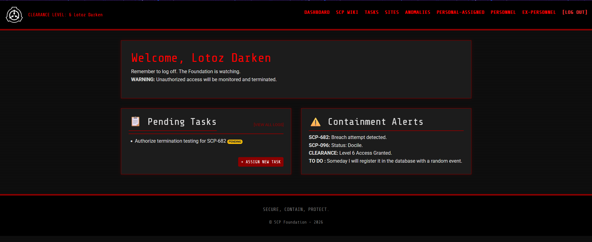
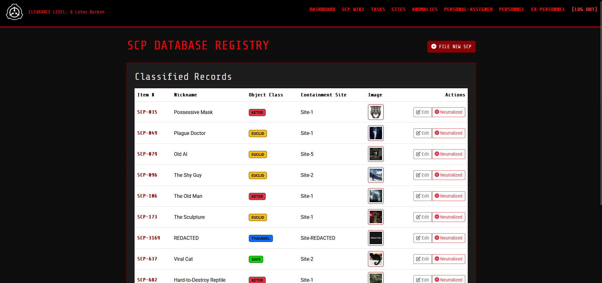
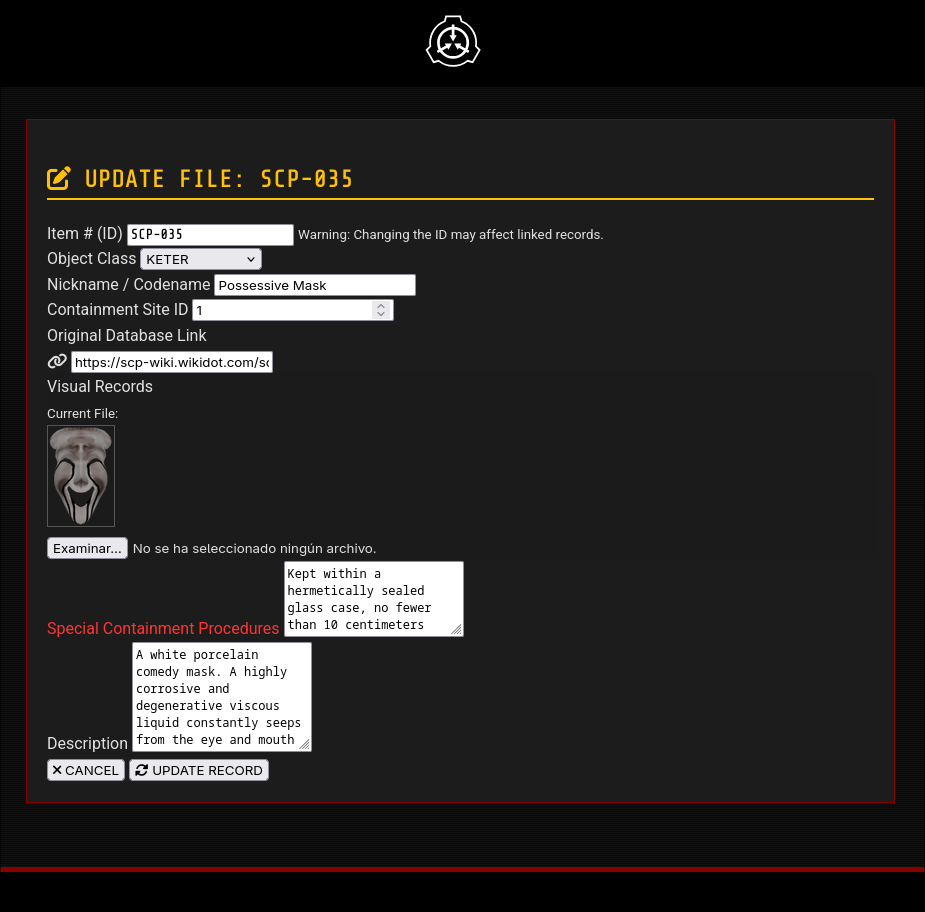
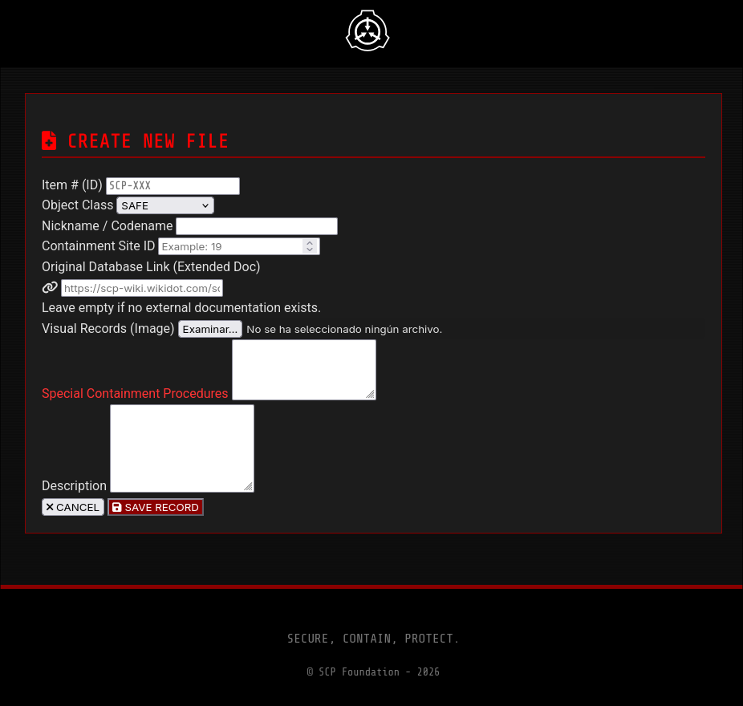
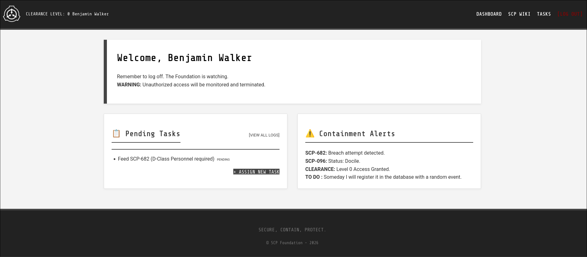
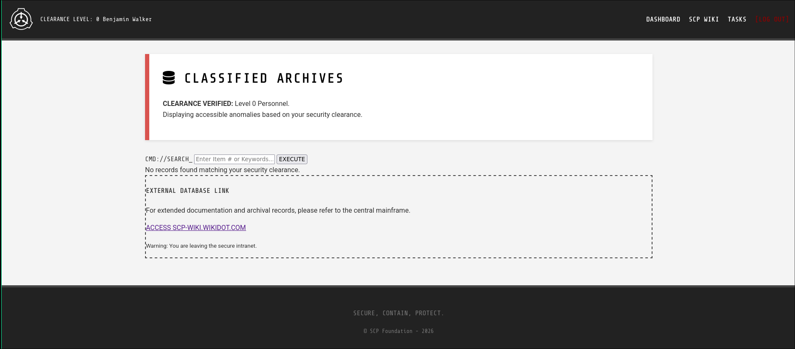
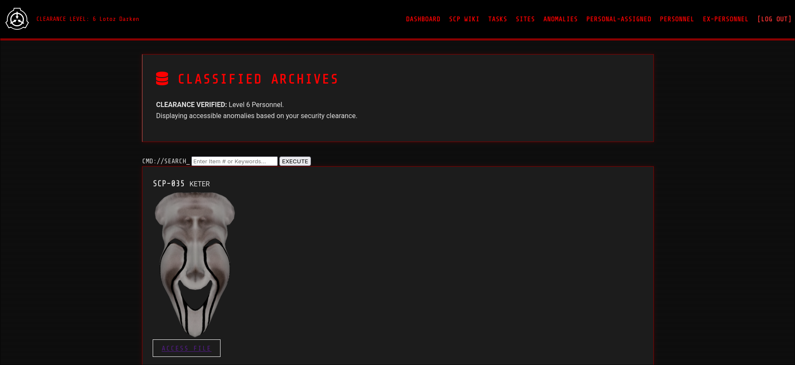
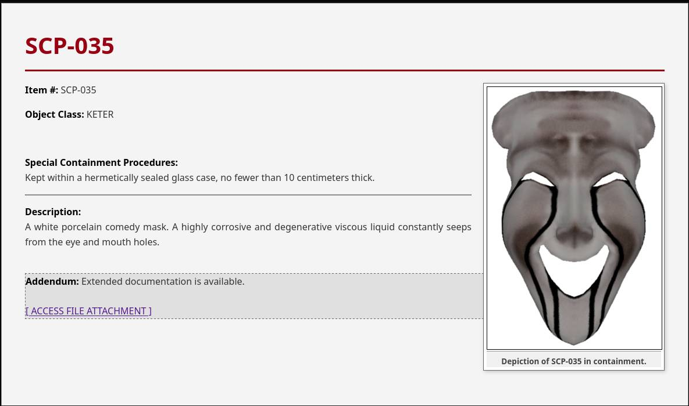

# SCP Foundation Secure Database System

<div align="center">


</div>

<p align="center">
  <a href="README.es.md">🇪🇸 Versión README en Español</a>
  <a href="https://enchanting-chive-10c.notion.site/SCP-Foundation-Secure-Database-System-2ed4d660fb3b80ea82cff7f8b43f28aa#2ed4d660fb3b8014b37ac680a458972b" >     📖 Project documentation (more extensive) </a>
</p>

> **⚠️ WARNING:** This software is an **educational project** developed to demonstrate skills in **Native PHP, OOP, and MVC Architecture**. It is not designed for use in critical production environments.

## 📖 General Description

The **SCP Secure Database System** is a *Full-Stack* web application that simulates the classified database of the SCP Foundation. It allows secure management of anomaly files, personnel administration, containment site assignments, and operational tasks.

The system is built strictly following the **Model-View-Controller (MVC)** pattern without using frameworks, ensuring clean, modular, and scalable code.

---

## 🚀 Main Features

### 🔐 Security and Authentication

* **Login System:** Roles and Security Levels (1 to 5).
* **Protection:** Password hashing (`Bcrypt`), CSRF tokens in forms, and protection against *Session Fixation*.
* **Error Prevention:** Self-deletion blocking (an administrator cannot delete their own account).

### 📂 Anomaly Management (SCPs)

* **Full CRUD:** Create, read, edit, and delete files.
* **Multimedia Management:** Image upload with **automatic renaming** based on the SCP ID.
* **Public Wiki:** Dynamic card visualization with styles according to the object's class (Safe, Euclid, Keter).

### 🛠️ Personnel Administration

* **Full Control:** Exclusive panel for Level 5 (O5 Council).
* **UX:** Password visualization with *toggle* button and real-time validations (JS).

---

## ⚙️ Technologies Used

* **Backend:** PHP 8.2+ (Native, OOP).
* **Database:** MySQL / MariaDB (InnoDB).
* **Frontend:** HTML5, CSS3, Bootstrap 5, JavaScript (ES6).
* **Server:** Apache (XAMPP/LAMPP).

---

## 📋 System Rules (Lore & Business Logic)

This project implements strict rules to simulate the SCP Foundation's bureaucracy:

1. **SCP Nomenclature:** All anomaly IDs must strictly start with **`SCP-`** (e.g., `SCP-173`).
2. **Containment Protocol:**
    * Classes **SAFE, EUCLID, and NEUTRALIZED** *must* have a Containment Site assigned mandatorily.
    * Classes **KETER and THAUMIEL** are the only ones that can have unknown location (`NULL`).
3. **User Integrity:**
    * Usernames only accept letters, numbers, hyphens, and underscores (Regex: `/^[a-zA-Z0-9_-]+$/`).
    * A Level 0 user (Class-D) has *Read-Only* access to their tasks.

---

## 🔧 Installation and Deployment

Follow these steps to set up the project in your local environment:

### 1. Clone the Repository

```bash
git clone https://github.com/Lotoz/SCP_CRUD_PHP
```

### 2. Configure the Local Server

1. Database

    Open your database manager (phpMyAdmin, DBeaver, etc.).

    Create a database named scp_data.

    Import the script located in: 📂 DATABASE/scp_data.sql

2. Configuration

Edit the configuration file with your local credentials: 📂 SCP_CRUD_PHP/config/Database.php (If you want, you can use the default: view.)

```php
private $host = "localhost";
private $db_name = "scp_data";
private $username = ""; // Your username
private $password = "";     // Your password
```

Default credentials are view / yX/I!geU1xKbG3F[ for testing purposes.

3. Copy the directory to your server's root folder (e.g., `htdocs` for XAMPP).

You must copy SCP_CRUD_PHP/ to the server root. This directory contains all the source code.

4. Permissions (Linux/Mac Only)

Ensure the upload folder has write permissions:

```bash
chmod -R 777 views/CRUD/anomalies/assets/img/
```
5. Enable your server or start XAMPP/LAMPP.

6. Access the application via your browser:

```bash
http://localhost/SCP_CRUD_PHP/
```

7. Enjoy exploring the SCP Foundation Secure Database System!

---

## 📂 Project Structure

```
/
├── DATABASE/           # SQL Scripts and Seeders
├── EXTRA/              # Test Credentials and Notes
├── pictures_README/    # Images for Documentation
├── SCP_CRUD_PHP/       # APPLICATION SOURCE CODE
│   ├── config/         # DB Connection and SessionManager
│   ├── controllers/    # Business Logic
│   ├── models/         # Entities
│   ├── repositories/   # SQL Queries (Repository Pattern)
│   ├── views/          # User Interface (HTML/PHP)
│   └── index.php       # Main Router
└── README.md           # This file
```

---

## 🔑 Access Credentials (Demo)

You can find a complete list of test users in the 📂 EXTRA/ folder.

---

### 📸 Pictures

| Login | Register | Dashboard |
|-------|----------|-----------|
|  |  |  |

**Temas Disponibles:**

| Gears | Ice | Sophie |
|-------|-----|--------|
|  |  |  |

| Unicorn | Clef | Admin |
|---------|------|-------|
|  |  |  |

## Example of Anomaly Management

| Anomalies | Edit | Create |
|---------  |------| -------|
|  |  |  |

## Example of view Class-D (Level 0)

| Tasks | View SCPs |
|-------|-----------|
|  |  |

## SCP Wiki Public View

| SCP Wiki | SCP  |
|----------|------|
|  |  |

## 🎥 Demo Video

You can see the application in this video: [SCP Secure Database System - Demo Video]()

---

## TO DO List

- [] Add more user roles and permissions.
- [] Enhance frontend with more interactive features (AJAX).
- [] Improve the aesthetics of alerts.
- [] More lore SCP Foundation integration.
- [] Add notifications system. (This maybe is randomly sending alerts to users about containment breaches, etc.)

---
Secure. Contain. Protect.

<div align="center"> <sub>Developed with ❤️ by <a href="https://github.com/Lotoz">Lotoz</a></sub> </div>
